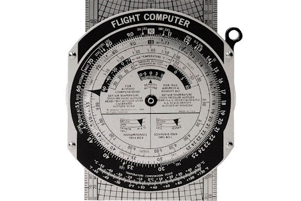

# TAL CARP 

## Description

An app that automatically calculates the **Computed Air Release Point**, an optimal point to launch an airlift package. Usually, this calculation is made by the use of a “Flight Computer”, a plastic device that gives out certain information to calculate the CARP. The only problem is that the total process might take over an hour, in calculating and drawing the final product. With this app, such task can be performed in seconds.

**A traditional Flight Computer:**

A sample demonstration can be seen in the **example.pdf** file. 

The GUI display is available on **GUI_screenshot.png**

One big consideration is that, as oppose to some older automatic CARP methods (REGIS') within the Brazilian Air Force (BAF) is that with this app the final file is actually drawn out, and not only the values are printed on some prefab drawing, bringing more accuracy to the entire process, as well as better design.

## Motivation

→ In my opinion, the traditional process is pretty outdated, also taking in consideration that the whole CARP-making task, when done quickly, takes around 1 or 2 hours, precious time to me

→ I must point that this is one of my first actual projects, since I'm very new to Python and programming in general

→ Last, but not least, I hope to leave something for all the other pilots to use, and ultimatelly to increase efficiency and precision in all of the BAF real missions. This is certainly just a headstart, and I hope to develop another system for further helping the mission as a whole

## Functionalities

→ GUI for ease of use with non-programmers (almost everyone within the target audience)

→ Parachute wind limits automatically printed to the final document

→ .exe file for running on devices without Python installed (pyinstaller)

→ **The pre-filled data corresponds to a single T-10 A/C parachute, with a load weight of 400 lbs**

## Next Improvements

→ Optimize app launch time (usually takes a few seconds until the GUI is launched)

→ Add a calculation for multiple parachute launch

→ Minimize loadtime and file size (v.08 takes around 56mb)
	
  → Maybe restart the virtual environment, adding only the necessary modules

→ Polish the code
